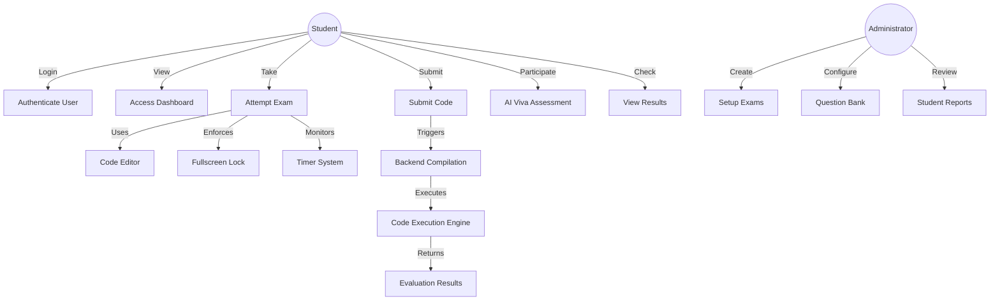
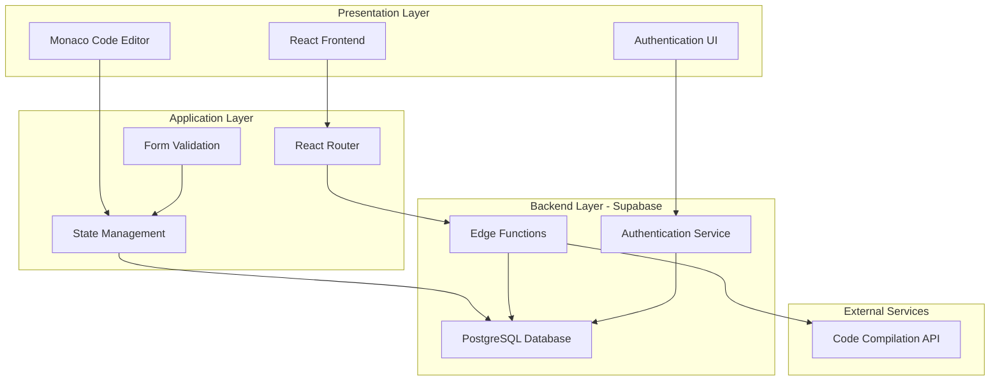
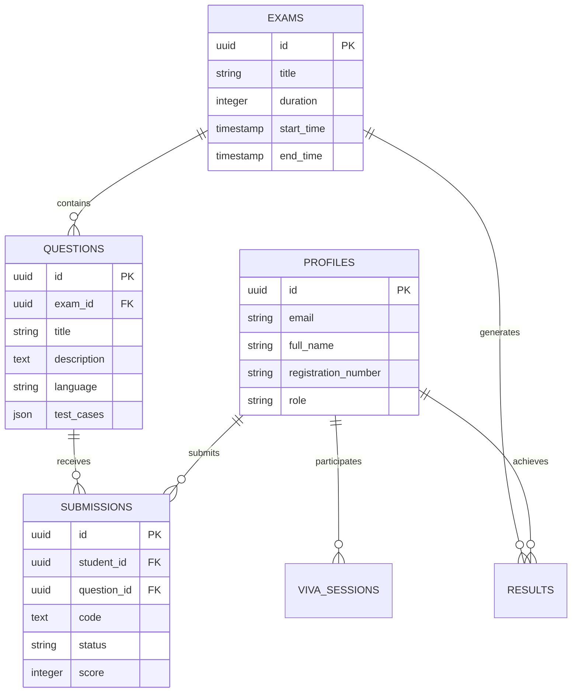

# AI-BASED EXAMINATION COMPILER

**Student Name:** [Your Name]  
**Roll No:** [Your Roll Number]  
**Course:** [Your Course]  
**Guide:** [Guide Name]  
**Semester:** [Semester]  
**Institution:** [Institution Name]  
**Submission Date:** October 17, 2025

---

## ABSTRACT

The AI-based examination compiler is an innovative online examination system designed to revolutionize coding assessments through intelligent automation and robust security measures. This web-based platform enables students to participate in programming tests within a controlled, monitored environment featuring real-time code compilation, automated evaluation, and AI-powered viva assessments. Built using modern web technologies including React, TypeScript, and Supabase backend services, the system provides a seamless interface for code editing, execution, and result tracking. The platform enforces examination integrity through fullscreen locking mechanisms and time-based constraints while delivering instant feedback on code submissions across multiple programming languages including Java, Python, C++, and Shell scripting.

**Keywords:** Online Examination, Code Compiler, AI Assessment, Secure Testing, Real-time Evaluation

---

## PAGE 2: PROBLEM STATEMENT, OBJECTIVES & SCOPE

### 1. INTRODUCTION / BACKGROUND

Traditional coding examinations face significant challenges in terms of scalability, security, and real-time evaluation. Manual assessment of programming assignments is time-consuming and prone to inconsistencies. Remote examination systems often lack adequate proctoring mechanisms, leading to academic integrity concerns. Furthermore, existing platforms struggle to provide immediate feedback and support multiple programming languages simultaneously. The need for an intelligent, automated, and secure examination system has become crucial in modern educational institutions.

### 2. PROBLEM STATEMENT

How can we create a secure, scalable, and intelligent online examination platform that automates code compilation, evaluation, and viva assessments while ensuring academic integrity and providing real-time feedback to students across multiple programming languages?

### 3. OBJECTIVES

- **Secure Examination Environment:** Implement fullscreen locking and monitoring mechanisms to prevent malpractice during online coding tests
- **Multi-language Support:** Enable code compilation and execution for Java, Python, C++, C, and Shell programming languages
- **Real-time Evaluation:** Provide instant feedback on code submissions with automated test case validation
- **AI-powered Viva:** Integrate intelligent question-answer systems for conducting automated viva-voce examinations
- **Performance Analytics:** Generate comprehensive result reports and performance metrics for each student
- **Scalable Architecture:** Design a system capable of handling multiple concurrent examinations without performance degradation

### 4. SCOPE & LIMITATIONS

**Scope:**
- Web-based examination platform accessible from any modern browser
- Support for multiple programming languages (Java, Python, C++, C, Shell)
- Real-time code editing with syntax highlighting via Monaco Editor
- Automated compilation and execution using backend Edge Functions
- Secure authentication and user session management
- Timer-based examination control with automatic submission

**Limitations:**
- Requires stable internet connectivity throughout the examination
- Limited to text-based programming questions (no GUI/graphics testing)
- Code execution timeout set at 10 seconds per submission
- Browser compatibility restricted to modern browsers (Chrome, Firefox, Edge)

### 5. USE CASE DIAGRAM



---

## PAGE 3: TOOLS, DESIGN & DATA MODEL

### 5. TECHNOLOGY STACK

**Frontend Technologies:**
- **React 18.3.1** — Component-based UI framework for building interactive interfaces
- **TypeScript** — Type-safe JavaScript for robust code quality
- **Vite** — Fast build tool and development server
- **Tailwind CSS** — Utility-first CSS framework for responsive design
- **Monaco Editor (@monaco-editor/react 4.7.0)** — VS Code-powered code editor component
- **React Router DOM 6.30.1** — Client-side routing and navigation
- **React Hook Form 7.61.1** — Form validation and state management
- **Zod 3.25.76** — Schema validation library
- **Lucide React** — Icon library for UI elements

**Backend Technologies:**
- **Supabase** — Backend-as-a-Service (PostgreSQL database, Authentication, Edge Functions)
- **Deno Runtime** — Secure TypeScript/JavaScript runtime for Edge Functions
- **PostgreSQL** — Relational database for storing user data, exam records, and results

**Development Tools:**
- **ESLint** — Code linting and quality enforcement
- **Git** — Version control system

### 6. SYSTEM ARCHITECTURE

The application follows a **three-tier architecture** with clear separation of concerns:



**Architecture Description:**
The system implements a modern client-server architecture where the React-based frontend communicates with Supabase backend services. User requests from the presentation layer pass through the application layer (routing, state management) to the backend layer where Edge Functions handle business logic, database operations, and external API calls to code compilation services. Authentication is managed centrally by Supabase Auth, ensuring secure access control throughout the application.

### 7. DATA MODEL / KEY TABLES

**Database Schema:**

| Table Name | Description | Key Columns |
|------------|-------------|-------------|
| **profiles** | User profile information | id (uuid), email, full_name, registration_number, role |
| **exams** | Examination metadata | id (uuid), title, duration, start_time, end_time, created_by |
| **questions** | Programming questions | id (uuid), exam_id, title, description, language, test_cases, points |
| **submissions** | Code submissions | id (uuid), student_id, question_id, code, language, status, score |
| **viva_sessions** | AI viva records | id (uuid), student_id, exam_id, questions, answers, score |
| **results** | Final examination results | id (uuid), student_id, exam_id, total_score, percentage, status |

**Entity Relationship:**



**Input/Output Flow:**

| Component | Input | Output |
|-----------|-------|--------|
| Login Page | Registration number, Password | Authentication token, User session |
| Code Editor | Source code, Language selection | Formatted code with syntax highlighting |
| Compilation Service | Code, Language, Input data | Compilation output, Execution result, Error messages |
| Exam Timer | Exam duration | Countdown display, Auto-submit trigger |
| Results Page | Exam ID, Student ID | Score breakdown, Performance metrics |

---

## PAGE 4: STEP-BY-STEP WORKED PROCEDURE

### STEP 1: PROJECT SETUP & INITIALIZATION

**Frontend Setup:**

1. Created React + TypeScript project using Vite
2. Installed dependencies:
   ```bash
   npm install react react-dom react-router-dom
   npm install @monaco-editor/react lucide-react
   npm install @tanstack/react-query react-hook-form zod
   npm install tailwindcss @radix-ui/react-*
   ```

3. Configured Tailwind CSS in `tailwind.config.ts`:
   ```typescript
   export default {
     content: ["./index.html", "./src/**/*.{js,ts,jsx,tsx}"],
     theme: { extend: { /* custom design tokens */ } }
   }
   ```

**Screenshot:** Project structure showing `src/` folder with pages, components, and configuration files

---

### STEP 2: FRONTEND DEVELOPMENT

**A. Login Page Implementation (`src/pages/Login.tsx`)**

The login page uses React Hook Form with Zod validation:

```typescript
const loginSchema = z.object({
  registrationNumber: z.string().min(5, "Invalid registration number"),
  password: z.string().min(6, "Password must be at least 6 characters"),
});
```

**Components used:**
- Form with Input fields for registration number and password
- Button component for form submission
- Toast notifications for success/error messages
- Shield icon and Lock icon from lucide-react

**Screenshot:** Login interface showing centered card with input fields, logo, and submit button

---

**B. Dashboard Page (`src/pages/Dashboard.tsx`)**

Displays available exams and student information:
- Card-based layout showing upcoming and ongoing exams
- Navigation to exam routes using React Router
- Real-time status updates (scheduled, ongoing, completed)

**Screenshot:** Dashboard with exam cards showing exam titles, duration, and "Start Exam" buttons

---

**C. Exam Page with Code Editor (`src/pages/Exam.tsx`, `src/components/exam/CodeEditor.tsx`)**

**Monaco Editor Integration:**

```typescript
import Editor from "@monaco-editor/react";

const CodeEditor = ({ language, value, onChange }) => {
  return (
    <Editor
      height="100%"
      language={languageMap[language] || "javascript"}
      value={value}
      onChange={(value) => onChange(value || "")}
      theme="vs-dark"
      options={{
        minimap: { enabled: false },
        fontSize: 14,
        lineNumbers: "on",
        scrollBeyondLastLine: false,
        automaticLayout: true,
        tabSize: 2,
        wordWrap: "on",
      }}
    />
  );
};
```

**Key Features:**
- Language selector (Java, Python, C++, C, Shell)
- Syntax highlighting and code completion
- Resizable panels for question and editor
- Submit button to send code to backend

**Screenshot:** Split-screen interface — left panel showing question, right panel showing Monaco code editor with sample code

---

**D. Exam Timer Component (`src/components/exam/ExamTimer.tsx`)**

Real-time countdown with color-coded warnings:

```typescript
const formatTime = (seconds: number) => {
  const hours = Math.floor(seconds / 3600);
  const minutes = Math.floor((seconds % 3600) / 60);
  const secs = seconds % 60;
  return `${hours}:${minutes}:${secs}`;
};

// Color changes: green (>15min) → yellow (5-15min) → red (<5min)
```

**Screenshot:** Timer display showing "01:23:45" with clock icon in header

---

**E. Fullscreen Lock (`src/components/exam/FullscreenLock.tsx`)**

Enforces fullscreen mode during examination:
- Detects fullscreen exit attempts
- Shows warning dialog if user tries to exit
- Prevents tab switching and window minimization

**Screenshot:** Warning dialog appearing when user attempts to exit fullscreen

---

### STEP 3: BACKEND DEVELOPMENT (SUPABASE EDGE FUNCTIONS)

**A. Supabase Project Setup**

1. Enabled Lovable Cloud (Supabase backend)
2. Created `supabase/config.toml` configuration:

```toml
[functions.compile-code]
verify_jwt = true
```

---

**B. Edge Function: Code Compilation Service**

**File:** `supabase/functions/compile-code/index.ts`

```typescript
import { serve } from "https://deno.land/std@0.168.0/http/server.ts";
import { createClient } from 'https://esm.sh/@supabase/supabase-js@2';

const corsHeaders = {
  'Access-Control-Allow-Origin': '*',
  'Access-Control-Allow-Headers': 'authorization, x-client-info, apikey, content-type',
};

serve(async (req) => {
  // Handle CORS
  if (req.method === 'OPTIONS') {
    return new Response(null, { headers: corsHeaders });
  }

  try {
    const { code, language, input } = await req.json();
    
    // Call external compilation API (e.g., JDoodle)
    const response = await fetch('https://api.jdoodle.com/v1/execute', {
      method: 'POST',
      headers: { 'Content-Type': 'application/json' },
      body: JSON.stringify({
        script: code,
        language: language,
        stdin: input,
        clientId: Deno.env.get('JDOODLE_CLIENT_ID'),
        clientSecret: Deno.env.get('JDOODLE_SECRET'),
      }),
    });

    const result = await response.json();
    
    // Store submission in database
    const supabase = createClient(
      Deno.env.get('SUPABASE_URL') ?? '',
      Deno.env.get('SUPABASE_SERVICE_ROLE_KEY') ?? ''
    );
    
    await supabase.from('submissions').insert({
      code,
      language,
      output: result.output,
      status: result.statusCode === 200 ? 'success' : 'error',
    });

    return new Response(
      JSON.stringify({ output: result.output, error: result.error }),
      { headers: { ...corsHeaders, 'Content-Type': 'application/json' } }
    );
  } catch (error) {
    return new Response(
      JSON.stringify({ error: error.message }),
      { headers: { ...corsHeaders, 'Content-Type': 'application/json' }, status: 400 }
    );
  }
});
```

**Screenshot:** Edge function code in file explorer showing `supabase/functions/compile-code/index.ts`

---

### STEP 4: DATABASE SETUP (SQL COMMANDS)

**A. Create Profiles Table:**

```sql
-- User profiles table
CREATE TABLE profiles (
  id UUID PRIMARY KEY REFERENCES auth.users(id) ON DELETE CASCADE,
  email TEXT UNIQUE NOT NULL,
  full_name TEXT,
  registration_number TEXT UNIQUE,
  role TEXT DEFAULT 'student',
  created_at TIMESTAMP WITH TIME ZONE DEFAULT NOW()
);

-- Enable Row Level Security
ALTER TABLE profiles ENABLE ROW LEVEL SECURITY;

-- Policy: Users can view their own profile
CREATE POLICY "Users can view own profile"
  ON profiles FOR SELECT
  USING (auth.uid() = id);
```

**Screenshot:** Supabase SQL Editor showing CREATE TABLE command execution

---

**B. Create Exams Table:**

```sql
CREATE TABLE exams (
  id UUID PRIMARY KEY DEFAULT gen_random_uuid(),
  title TEXT NOT NULL,
  description TEXT,
  duration INTEGER NOT NULL, -- in minutes
  start_time TIMESTAMP WITH TIME ZONE,
  end_time TIMESTAMP WITH TIME ZONE,
  created_by UUID REFERENCES profiles(id),
  created_at TIMESTAMP WITH TIME ZONE DEFAULT NOW()
);

ALTER TABLE exams ENABLE ROW LEVEL SECURITY;

CREATE POLICY "Anyone can view exams"
  ON exams FOR SELECT
  USING (true);
```

**Screenshot:** Database schema viewer showing tables and relationships

---

**C. Create Submissions Table:**

```sql
CREATE TABLE submissions (
  id UUID PRIMARY KEY DEFAULT gen_random_uuid(),
  student_id UUID REFERENCES profiles(id) ON DELETE CASCADE,
  question_id UUID REFERENCES questions(id),
  code TEXT NOT NULL,
  language TEXT NOT NULL,
  output TEXT,
  status TEXT, -- 'success', 'error', 'timeout'
  score INTEGER DEFAULT 0,
  submitted_at TIMESTAMP WITH TIME ZONE DEFAULT NOW()
);

ALTER TABLE submissions ENABLE ROW LEVEL SECURITY;

CREATE POLICY "Students can view own submissions"
  ON submissions FOR SELECT
  USING (auth.uid() = student_id);

CREATE POLICY "Students can insert submissions"
  ON submissions FOR INSERT
  WITH CHECK (auth.uid() = student_id);
```

**Screenshot:** SQL command execution result showing "Success. No rows returned"

---

### STEP 5: FRONTEND-BACKEND CONNECTIVITY

**A. Supabase Client Setup:**

**File:** `src/integrations/supabase/client.ts`

```typescript
import { createClient } from '@supabase/supabase-js';

const supabaseUrl = import.meta.env.VITE_SUPABASE_URL;
const supabaseKey = import.meta.env.VITE_SUPABASE_ANON_KEY;

export const supabase = createClient(supabaseUrl, supabaseKey);
```

**Environment Variables (`.env`):**

```
VITE_SUPABASE_URL=https://xxxxx.supabase.co
VITE_SUPABASE_ANON_KEY=eyJxxx...xxxxx
```

**Screenshot:** `.env` file showing Supabase credentials (partially masked)

---

**B. Calling Edge Function from React:**

**File:** `src/pages/Exam.tsx` (submission handler)

```typescript
import { supabase } from '@/integrations/supabase/client';

const handleSubmitCode = async () => {
  try {
    const { data, error } = await supabase.functions.invoke('compile-code', {
      body: {
        code: editorCode,
        language: selectedLanguage,
        input: testInput,
      },
    });

    if (error) throw error;

    // Display output
    setOutput(data.output);
    toast({
      title: "Code Compiled Successfully",
      description: "Check the output panel for results",
    });
  } catch (err) {
    toast({
      title: "Compilation Error",
      description: err.message,
      variant: "destructive",
    });
  }
};
```

**Screenshot:** Browser DevTools Network tab showing POST request to `/functions/v1/compile-code` with status 200

---

**C. Authentication Flow:**

```typescript
// Login handler
const handleLogin = async (data) => {
  const { data: authData, error } = await supabase.auth.signInWithPassword({
    email: data.registrationNumber + '@exam.edu',
    password: data.password,
  });

  if (error) {
    toast({ title: "Login Failed", description: error.message });
    return;
  }

  navigate('/dashboard');
};

// Check authentication status
useEffect(() => {
  supabase.auth.onAuthStateChange((event, session) => {
    if (event === 'SIGNED_IN') {
      setUser(session?.user);
    }
  });
}, []);
```

**Screenshot:** Browser Console showing successful authentication with user object logged

---

**D. Real-time Data Fetching:**

```typescript
// Fetch available exams
const { data: exams } = useQuery({
  queryKey: ['exams'],
  queryFn: async () => {
    const { data, error } = await supabase
      .from('exams')
      .select('*')
      .order('start_time', { ascending: true });
    
    if (error) throw error;
    return data;
  },
});
```

**Screenshot:** React Query DevTools showing cached exam data

---

### DEPLOYMENT & TESTING

**Testing Procedure:**
1. Run development server: `npm run dev`
2. Test login with sample credentials
3. Start an exam and verify fullscreen lock
4. Write sample code in editor (e.g., Python "Hello World")
5. Submit code and verify compilation output
6. Check database for submission record
7. Complete exam and view results page

**Screenshot:** Final deployed application showing all pages in sequence

---

## CONCLUSION

The AI-based examination compiler successfully demonstrates a modern, secure, and scalable solution for conducting online coding assessments. The integration of React frontend with Supabase backend provides a robust foundation for real-time code compilation, automated evaluation, and comprehensive result tracking. Future enhancements may include plagiarism detection, advanced AI proctoring, and support for additional programming languages.

---

**References:**
- React Documentation: https://react.dev
- Supabase Documentation: https://supabase.com/docs
- Monaco Editor: https://microsoft.github.io/monaco-editor
- TypeScript Handbook: https://www.typescriptlang.org/docs
